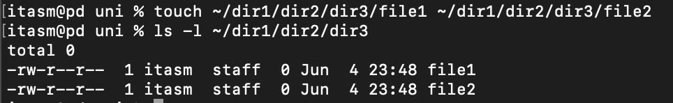

# Лабораторная работа №1

**Цель работы:** Изучение команд для получения информации о системе и навыков работы с каталогами, файлами и правами доступа.

## Задание 1.1 Средства просмотра системной информации

### Цель: 
Изучение команд для получения информации о системе.

### Порядок выполнения:

1. **Отобразить используемую версию ядра**

   **Команда:** 
   ```sh
   itasm@pd uni % uname -r
   ```

   **Объяснение:** 
   Команда `uname -r` отображает текущую версию ядра операционной системы.

   

2. **Отобразить память занятую под дисковый кэш**

   **Команда:** 
   ```sh
   itasm@pd uni % vm_stat
   ```

   **Объяснение:** 
   Команда `vm_stat` отображает статистику использования виртуальной памяти, включая информацию о дисковом кэше.

   

## Задание 1.2 Команды для работы с каталогами, папками и файлами

### Цель:
Получить навыки работы с каталогами, папками и файлами.

### Порядок выполнения:

1. **Создать директорию и подтвердить создание**

   **Команды:**
   ```sh
   itasm@pd uni % mkdir ~/dir1
   itasm@pd uni % ls -l ~
   ```

   

2. **Создать в dir1 папки dir2 и dir4, а также dir3 внутри dir2**

   **Команды:**
   ```sh
   itasm@pd uni % mkdir ~/dir1/dir2 ~/dir1/dir4
   itasm@pd uni % mkdir ~/dir1/dir2/dir3
   itasm@pd uni % ls -l ~/dir1
   itasm@pd uni % ls -l ~/dir1/dir2
   ```

   

3. **Создать файлы file1 и file2 внутри dir3, создать файл file4**

   **Команды:**
   ```sh
   itasm@pd uni % touch ~/dir1/dir2/dir3/file1 ~/dir1/dir2/dir3/file2
   itasm@pd uni % ls -l ~/dir1/dir2/dir3
   ```

   

4. **Скопировать dir3 в dir1**

   **Команда:**
   ```sh
   itasm@pd uni % cp -r ~/dir1/dir2/dir3 ~/dir1/
   itasm@pd uni % ls -l ~/dir1
   ```

   

5. **Скопировать файл из dir3 в dir2 и удалить dir3**

   **Команды:**
   ```sh
   itasm@pd uni % cp ~/dir1/dir2/dir3/file2 ~/dir1/dir2/
   itasm@pd uni % rm -r ~/dir1/dir2/dir3
   itasm@pd uni % ls -l ~/dir1/dir2
   ```

   

6. **Переименовать file4 и переместить его в dir1**

   **Команды:**
   ```sh
   itasm@pd uni % mv ~/dir1/dir2/dir3/file4 ~/dir1/Empty
   itasm@pd uni % ls -l ~/dir1
   ```

   

7. **Переместить файлы из dir3 в dir4 и удалить пустую папку**

   **Команды:**
   ```sh
   itasm@pd uni % mv ~/dir1/dir3/file* ~/dir1/dir4/
   itasm@pd uni % rmdir ~/dir1/dir3
   itasm@pd uni % ls -l ~/dir1/dir4
   ```

   

8. **Создать и редактировать текстовый документ**

   **Команды:**
   ```sh
   itasm@pd uni % nano ~/dir1/finita
   ```

   **Содержимое файла:**
   ```
   Все задания выполнили. Команды для работы с папками файлами и каталогами выучили.
   ```

   

9. **Вывести содержимое файла finita в терминале**

   **Команда:**
   ```sh
   itasm@pd uni % cat ~/dir1/finita
   ```

   

## Задание 1.3 Управление правами доступа к файлам и каталогам

### Цель:
Получить навыки работы с правами доступа к файлам и каталогам.

### Порядок выполнения:

1. **Вывести полную информацию обо всех файлах из выбранной директории**

   **Команда:**
   ```sh
   itasm@pd uni % ls -l ~/dir1
   ```

   

2. **Удалить права на чтение и проанализировать результат**

   **Команды:**
   ```sh
   itasm@pd uni % chmod -r ~/dir1/finita
   itasm@pd uni % cat ~/dir1/finita
   ```

   Удаление прав на чтение лишает возможности чтения содержимого файла.

   

3. **Удалить права на запись и проанализировать результат**

   **Команды:**
   ```sh
   itasm@pd uni % chmod -w ~/dir1/finita
   itasm@pd uni % echo "Дополнение" >> ~/dir1/finita
   ```

   Удаление прав на запись лишает возможности изменения содержимого файла.

   

4. **Добавить право выполнения и проанализировать результат**

   **Команды:**
   ```sh
   itasm@pd uni % chmod +x ~/dir1/finita
   itasm@pd uni % ./dir1/finita
   ```

   Добавление прав на выполнение позволяет запустить файл как исполняемый, однако данный файл не является исполняемым.

   

5. **Создать и запустить скрипт hello_world.sh**

   **Команды:**
   ```sh
   itasm@pd uni % echo '#!/bin/bash' > ~/dir1/hello_world.sh
   itasm@pd uni % echo 'echo "Hello World"' >> ~/dir1/hello_world.sh
   itasm@pd uni % chmod 755 ~/dir1/hello_world.sh
   itasm@pd uni % ~/dir1/hello_world.sh
   ```

   

## Заключение

В ходе выполнения лабораторной работы были изучены команды для получения системной информации, а также команды для работы с каталогами, файлами и правами доступа в ОС macOS. Получены навыки использования терминала и различных команд для эффективного управления системой.